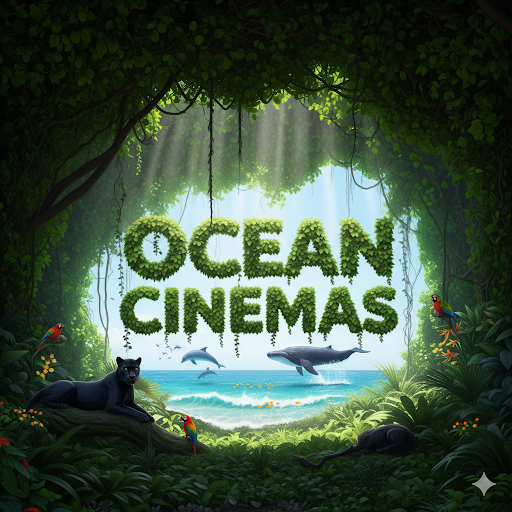

# 🎬 SNIPPET PARA AÑADIR LA INTRO CINEMATOGRÁFICA

## Ubicación:
Dentro de `<div id="cinema-room" ...>`, **ANTES** del elemento `<video id="cinema-video">`

## HTML a añadir:

```html
<!-- PRESENTACIÓN OCEAN CINEMAS -->
<div id ="ocean-intro-cinema" class="absolute inset-0 flex items-center justify-center bg-black z-[250] hidden">
  <div class="relative">
    <!-- Ondas de sonido animadas -->
    <div class="absolute inset-0 flex items-center justify-center">
      <div class="wave-ring"></div>
      <div class="wave-ring" style="animation-delay: 0.5s;"></div>
      <div class="wave-ring" style="animation-delay: 1s;"></div>
    </div>
    
    <!-- Logo Ocean Cinemas -->
    <div class="relative z-10 text-center">
      <div class="ocean-logo-animation mb-6">
        
      </div>
      <h1 class="ocean-text-animation text-5xl md:text-7xl font-black text-white opacity-0">
        OCEAN CINEMAS
      </h1>
      <div class="ocean-wave-line mt-6"></div>
    </div>
  </div>
</div>
```

## Cómo se verá en contexto:

```html
<div id="cinema-room" class="hidden fixed inset-0 bg-black z-[200]">
  <!-- AÑADIR AQUÍ LA PRESENTACIÓN OCEAN CINEMAS -->
  
  <!-- Video Principal -->
  <video id="cinema-video" class="w-full h-full object-contain">
    <source id="video-source" src="" type="video/mp4">
  </video>
  
  <!-- resto del código... -->
</div>
```

## ✅ Lo que hará:
1. **Al hacer clic en "Ver Película":**
   - Se abre la sala de cine
   - Se muestra la intro con animaciones (3 segundos)
   - Logo aparece con rotación
   - Texto "OCEAN CINEMAS" con efecto tracking
   - Ondas de sonido expandiéndose
   
2. **Después de 3 segundos:**
   - La intro desaparece automáticamente
   - El video queda listo para reproducir

## 📝 Nota:
- El JavaScript ya está listo y busca el elemento `#ocean-intro-cinema`
- El CSS con las animaciones ya existe en `styles.css`
- Solo falta añadir el HTML en el lugar indicado

---

**Desarrollado con ❤️ por Ocean and Wild Studios**
